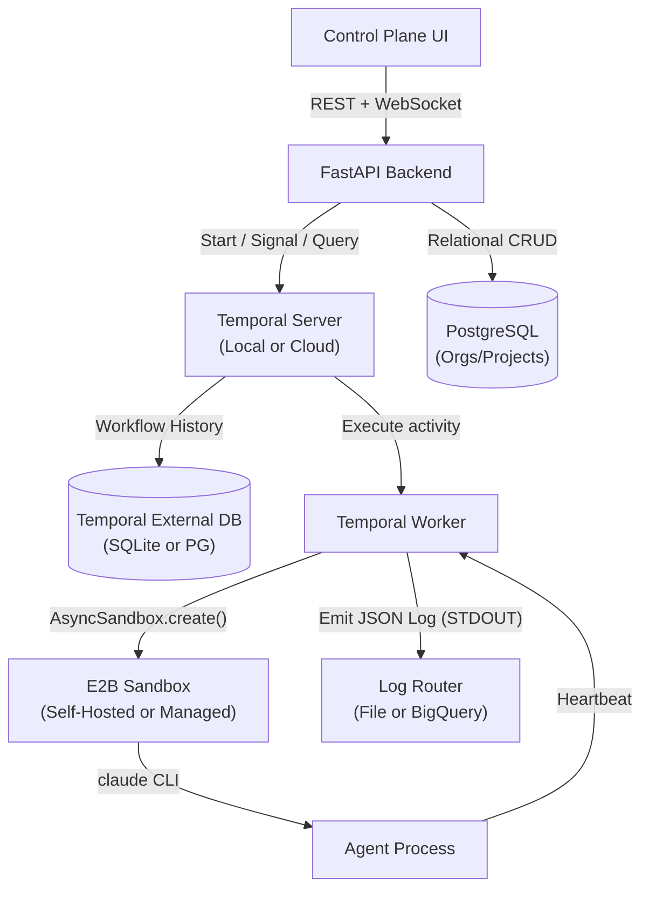
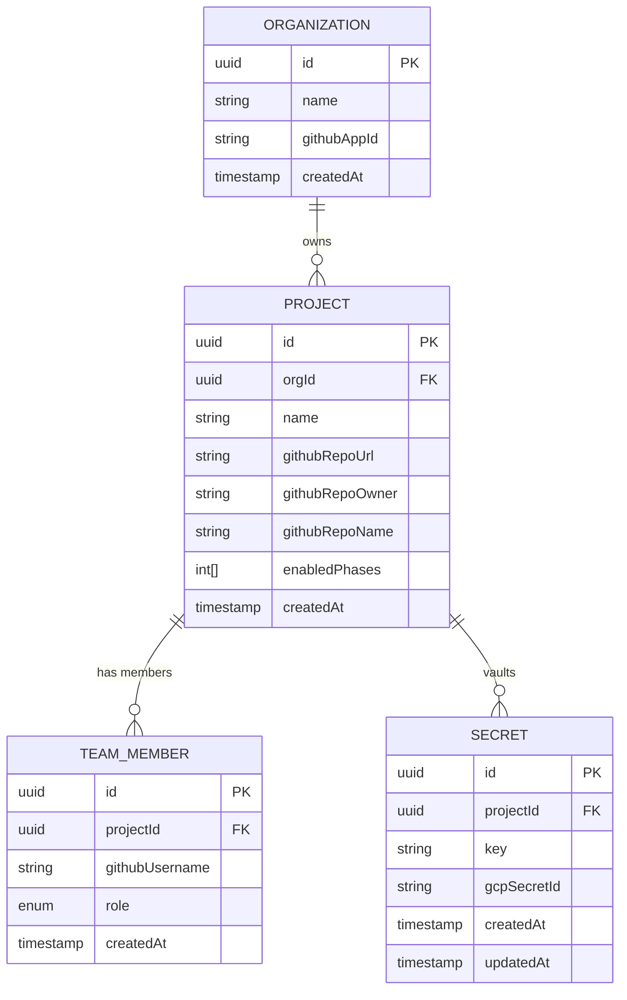
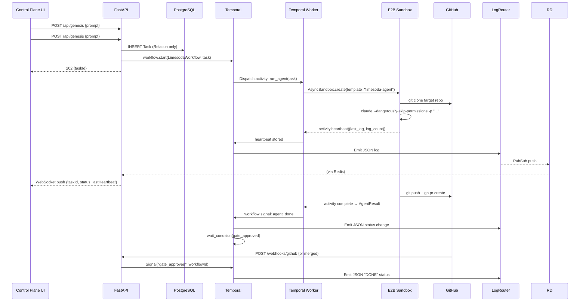

# Architecture Technical Design Document (RFC)
**Date:** March 2026
**Author:** A2 - Architect Agent
**Status:** Pending Gate 4 Human Sign-Off
**Input Artifacts:** `doc/01_prd/Limesoda_PRD.md`, `doc/02_ux_user_guide/`, `doc/02_dx_user_guide/`

---

## 1. System Context & Tech Stack Selection

### Summary
Limesoda is a multi-tenant Enterprise AI Orchestration SaaS. Its Control Plane manages a 10-phase SDLC pipeline where LLM agents execute software development tasks inside isolated sandboxes, with human gates at critical checkpoints.

**Authoritative Schemas:**
*   **API Contract**: [control_plane.proto](schema/proto/control_plane.proto)
*   **Database Schema**: [schema.prisma](schema/prisma/schema.prisma)

This RFC defines two tiers: **Community** (open source, self-hosted) and **Cloud** (managed SaaS). Community is a strict subset — Cloud adds operational services on top without forking the codebase.

---

### Two-Tier Stack


| Layer | Implementation (Unified) | Cloud Scaling Extension |
|---|---|---|
| **Frontend** | React 18 + Vite | (Standardized UI) |
| **Backend API** | Python 3.12 + FastAPI | Multi-instance Cloud Run |
| **Orchestration** | **Temporal** | Temporal Cloud |
| **Database** | **PostgreSQL 16** | GCP Cloud SQL (Managed) |
| **Audit Trail** | **STDOUT JSON Logs** | GCP Log Router → BigQuery |
| **Sandbox** | **E2B Core** | E2B Managed Cloud |
| **Real-time** | **WebSocket + Redis** | (Identical) |

### NFR Justification
- **Codebase Unification**: By using a unified stack (Vite + FastAPI + Temporal + E2B), the application logic remains identical across all environments. "Community" users can either self-host E2B Core via Docker or provide a managed API key. The Python SDK code remains identical.
- **Reduced Complexity**: PostgreSQL is the only relational store. No "Sync" tables are used; Temporal is the authority for all task states.
- **Operational Portability**: A project started on a local laptop (Community) can be migrated to the Cloud tier with zero code changes, only environment variable updates.

---

## 2. High-Level Architecture Diagrams

### Unified Architecture Flow (Community & Cloud)


---

## 3. Core Data Models / Database Schema

### 3.0 Entity Relationship Diagram



### 3.1 Security & Data Privacy Constraints

- **Secret values**: Never stored in PostgreSQL. The `Secret` table holds only the GCP Secret Manager resource name. The actual value is fetched at runtime via KMS-decrypted ADC.
- **Row-Level Security**: Tables enforce Postgres RLS based on the tenancy hierarchy (`orgId` for Projects, `projectId` for Secrets and Team Members). The API sets `app.current_org_id` and `app.current_project_id` context variables per request; RLS policies block cross-tenant/cross-project reads at the database layer.
- **PII**: `TeamMember.githubUsername` is the only PII field. It is not encrypted at rest (it's a public identifier) but is excluded from audit log exports.
- **Audit log retention**: 
    - **Unified Flow**: All components (API, Worker, Sandbox) emit structured JSON to `stdout`.
    - **Community**: Logs are captured by Docker/Systemd and rotated locally.
    - **Cloud**: Logs are captured by GCP Log Router and sunk to BigQuery for 365-day retention and SQL-based compliance auditing.

---

## 4. API Contracts

### 4.1 `POST /api/genesis` — Trigger new feature generation

**Auth:** `Bearer JWT (role: HUMAN_TECH_LEAD)`

**Request:**
```json
{
  "projectId": "uuid",
  "prompt": "Build a Stripe Checkout UI",
  "startPhase": 1 
}
```
*   `startPhase` (optional): The 1-indexed phase to begin the workflow (1=Research, 2=Product, 3=UX, 4=Design, 5=Plan, etc.). 
*   **AI-Driven Entry**: If `startPhase` is null or omitted, the system invokes a `claude-haiku-4-5` classifier to analyze the prompt and current repo state to determine the most logical entry point.

**Response `202 Accepted`:**
```json
{
  "taskId": "uuid",
  "temporalWorkflowId": "p{n}-build-a-stripe-checkout-ui-abc123",
  "phase": 1,
  "status": "PENDING"
}
```

**Failure codes:** `400` (empty prompt), `403` (wrong role), `404` (project not found), `429` (rate limit: max 5 genesis/org/hour)

---

### 4.2 `GET /api/projects/{projectId}/tasks` — Task registry (agent dashboard)

**Auth:** `Bearer JWT (role: HUMAN_TECH_LEAD)`

**Query params:** `?status=WORKING&phase=1`

**Response `200`:**
```json
{
  "tasks": [
    {
      "id": "uuid",
      "phase": 1,
      "status": "WORKING",
      "genesisPrompt": "Build a Stripe Checkout UI",
      "githubIssueNumber": 42,
      "retryCount": 1,
      "lastHeartbeat": {
        "last_log": "[REVIEWER: Data Analyst] STATUS: PASS",
        "log_count": 34
      },
      "updatedAt": "2026-03-21T10:00:00Z"
    }
  ],
  "total": 1
}
```

---

### 4.3 `POST /api/tasks/{taskId}/override` — Manual phase fulfillment

**Auth:** `Bearer JWT (role: HUMAN_TECH_LEAD)`

**Request:**
```json
{
  "action": "FULFILL",
  "note": "Manually approved — architecture looks correct"
}
```

**Response `200`:**
```json
{ "taskId": "uuid", "status": "DONE", "overriddenBy": "dongyujia" }
```

Sends a Temporal `Signal("manual_override")` to the workflow, which skips the current gate.

---

### 4.4 `POST /api/webhooks/github` — GitHub App event handler

**Auth:** `X-Hub-Signature-256` HMAC verification (GitHub App secret)

**Handled events:**

| Event | Action | Effect |
|---|---|---|
| `pull_request` | `opened` \| `reopened` | Signal Temporal workflow: `pr_created` |
| `pull_request` | `review_requested` | Signal Temporal workflow: `human_review_notified` |
| `pull_request` | `closed` + `merged: true` | Signal Temporal workflow: `gate_approved` |
| `pull_request` | `closed` + `merged: false` | Signal Temporal workflow: `gate_rejected` |
| `issues` | `assigned` | Trigger corresponding sub-agent for the current phase |

---

### 4.5 `GET /api/health` — Cluster health

**Auth:** `Bearer JWT (role: SYSTEM_ADMIN or ORG_LEAD)`

**Response `200`:**
```json
{
  "temporal": {
    "status": "healthy",
    "runningWorkflows": 4,
    "pendingWorkflows": 2
  },
  "e2b": {
    "activeSandboxes": 3,
    "maxSandboxes": 10
  },
  "database": {
    "connectionPoolUsed": 8,
    "connectionPoolMax": 20
  },
  "github": {
    "rateLimitRemaining": 4200,
    "rateLimitResetAt": "2026-03-21T11:00:00Z"
  }
}
```

---

## 5. Infrastructure & Deployment Topology

### Community (self-hosted) — `docker compose up`

```yaml
# docker-compose.yml
services:
  api:       # FastAPI
  temporal:  # Temporal Server (Standard OSS Docker)
  temporal-ui: # Temporal Web UI
  postgres:  # PostgreSQL 16 (Relational only)
  e2b-core:  # Open Source E2B Sandbox daemon
  redis:     # Redis 7 (WebSocket PubSub)
  # No KMS.
```

Total: 3 containers, runs on a $20/month VPS.

### 5.1 Environment-Driven Topology

Limesoda uses a **Single-Dockerfile Architecture**. The same container image is used in all environments, with behavior controlled via environment variables.

| Requirement | Implementation Component | Local / Community | Production / Cloud |
|---|---|---|---|
| API / Logic | FastAPI App | Local Process | GCP Cloud Run |
| Orchestration | Temporal Server | [Temporal Server (Docker)](https://github.com/temporalio/temporal) | Temporal Cloud |
| DB | PostgreSQL 16 | Local Docker | GCP Cloud SQL |
| Secrets | Environment / Vault | `.env` | GCP Secret Manager |
| Sandboxes | Agent Execution | **E2B Core (Docker)** | **E2B Managed Cloud** |
| Log Sink | Audit / Observability | STDOUT (Console) | Log Router → BigQuery |

### CI/CD Pipeline (GitHub Actions)

```yaml
# .github/workflows/deploy.yml
on:
  push:
    branches: [main]

jobs:
  test:
    steps:
      - run: pip install -r requirements.txt
      - run: pytest --cov=app --cov-fail-under=90
      - run: ruff check .
      - run: mypy app/

  deploy:
    needs: test
    steps:
      - run: docker build -t gcr.io/$PROJECT/limesoda-api .
      - run: docker push gcr.io/$PROJECT/limesoda-api
      - run: gcloud run deploy limesoda-api --image gcr.io/$PROJECT/limesoda-api
```

### Required Environment Variables

| Variable | Where used | Source (Community) | Source (Cloud) |
|---|---|---|---|
| `DATABASE_URL` | FastAPI, Temporal | `.env` file | GCP Secret Manager |
| `REDIS_URL` | FastAPI | `.env` file | GCP Secret Manager |
| `TEMPORAL_HOST` | API, Worker | `.env` file | Cloud Run env var |
| `GITHUB_APP_ID` | API | `.env` file | GCP Secret Manager |
| `GITHUB_APP_PRIVATE_KEY` | API | `.env` file | GCP Secret Manager |
| `GITHUB_WEBHOOK_SECRET` | API | `.env` file | GCP Secret Manager |
| `GCP_PROJECT_ID` | API, Worker | `.env` file | Cloud Run env var |
| `E2B_API_KEY` | Worker | `.env` file | GCP Secret Manager |
| `ANTHROPIC_API_KEY` | Worker → injected into E2B | `.env` file | GCP Secret Manager |

---

## 6. Internal Module Interfaces & Event Flow

### 6.1 Genesis → Task → Agent Execution



### 6.2 WebSocket State Fan-Out

Temporal worker publishes heartbeat data to Redis PubSub channel `task:{taskId}:updates`. FastAPI maintains a WebSocket connection per browser tab subscribed to that channel. Redis fan-out delivers the event to all connected tabs in < 50ms.

---

## 7. Third-Party Integrations & Webhooks

### GitHub App
- **Integration method**: `PyGithub` SDK for repo operations, `hmac` for webhook signature verification
- **Webhooks received**: `pull_request` (merged/closed), `issues` (assigned)
- **Permissions required**: `contents: write`, `pull_requests: write`, `issues: write`
- **Endpoint**: `POST /api/webhooks/github`

### E2B
- **Integration method**: `e2b` Python SDK (`AsyncSandbox.create`)
- **Self-Hosting**: The Community tier uses the open-source [e2b-core](https://github.com/e2b-dev/e2b) ran locally via Docker. The Python SDK connects to this local daemon using the `E2B_DOMAIN` environment variable.
- **Template**: `limesoda-agent` (built from `engine/e2b.Dockerfile`)
- **Preinstalled**: `claude` CLI, `gh` CLI, `git`, `python3`, `langchain-anthropic`, `langgraph`, `tavily-python`
- **Concurrency limit**: Temporal `max_concurrent_activity_task_executions=10`

### Anthropic (Claude)
- **Integration method**: `langchain-anthropic` SDK inside E2B sandbox
- **Models**: `claude-sonnet-4-6` for generator/reviewer/judge; `claude-haiku-4-5` for background state classification
- **Key injection**: API key passed as E2B sandbox env var from GCP Secret Manager at activity start

### Tavily (Web Search)
- **Integration method**: `langchain-community` `TavilySearchResults` tool, bound to LangGraph generator node
- **Usage**: P1 market research only; 5 results per query, max ~10 queries per genesis

---

## 8. Error Handling & Standard Responses

### API Error Envelope
```json
{
  "error": {
    "code": "TASK_NOT_FOUND",
    "message": "Task uuid does not exist in this project",
    "httpStatus": 404
  }
}
```

### GitHub API Rate Limiting
Temporal worker detects HTTP 429 from GitHub API and implements exponential backoff via `RetryPolicy(initial_interval=10s, backoff_coefficient=2.0, max_interval=5min)`. The Temporal heartbeat keeps the activity alive during the wait.

### E2B Sandbox Crash
If `sbx.commands.run()` raises, the activity raises an `ApplicationError`. Temporal retries the activity (new sandbox created) up to `max_attempts=3`. On third failure, workflow transitions to `ESCALATED` and opens a GitHub Issue assigned to the Human Tech Lead.

### Duplicate PR Comment Prevention
Before an agent posts a PR comment or creates a PR, it checks for an existing PR on the branch using `gh pr list --head {branch}`. If one exists, it updates rather than creates. Idempotency key stored in Redis with TTL 24h.

---

## 9. SLO Summary

| Metric | Target | Enforcement |
|---|---|---|
| WebSocket state update P99 | < 500ms | Redis PubSub + async FastAPI |
| Agent node initiation | < 2s from trigger | Temporal dispatch + E2B ~200ms startup |
| Error visibility in dashboard | < 5s from failure | Heartbeat timeout 30s → status push via WS |
| GitHub sync (doc push → phase complete) | < 3s | GitHub webhook → Temporal signal → DB update |
| API availability | 99.9% (< 8.7h downtime/year) | GCP Cloud Run multi-instance + health checks |
| Sandbox concurrency | ≤ 10 | `max_concurrent_activity_task_executions=10` |

### Capacity Model (12 months)

| Resource | Estimate |
|---|---|
| Organizations | 50 |
| Projects | 250 (5 per org avg) |
| Tasks per month | 5,000 (20 per project) |
| DB storage growth | ~500MB/year (tasks only; audits offloaded to BigQuery) |
| E2B sandbox-hours | ~5,000/month at 1h avg per task |
| Temporal workflow history | ~500MB/year (compressed) |
| BigQuery Log Storage | ~10GB/year (High-frequency audit trail) |
| Estimated GCP cost (MVP scale) | ~$450/month (Cloud SQL $80, Cloud Run $150, BigQuery $20, Memorystore $60, Secret Manager $10, egress $100) |

---

## 10. Component Sub-Design Checklist (LLD Handoff)

These LLDs must be drafted in P6 (Component Design) before P7 (Implementation) begins. Each represents a discrete component that cannot be implemented without a detailed design contract.

- [ ] **Auth Module**: JWT issuance, refresh, GitHub OAuth flow, RBAC middleware. Mandate: use existing library (e.g., `python-jose` + FastAPI security utilities). Do NOT hand-roll JWT signing.
- [ ] **Temporal Workflow: LimesodaWorkflow**: Full state machine definition — all signals, activities, retry policies, human gate `wait_condition` logic, escalation path.
- [ ] **LangGraph Agent Graph (per phase)**: Per-phase LangGraph definition. Start with P1. Each phase = its own compiled graph with Generator→Reviewer(s)→Judge nodes and retry routing.
- [ ] **E2B Sandbox Lifecycle Manager**: Activity function that creates, monitors (heartbeat), and destroys E2B sandboxes. Handles crash recovery, duplicate prevention, result file protocol.
- [ ] **WebSocket State Bus**: FastAPI WebSocket endpoint + Redis PubSub subscriber. Connection management, authentication, fan-out logic.
- [ ] **GitHub Webhook Handler**: HMAC verification, event routing, Temporal signal dispatch, idempotency.
- [ ] **Secrets Vault API**: CRUD for `Secret` rows + GCP Secret Manager integration. KMS key ring provisioning per org. Secret view audit logging.
- [ ] **Multi-Tenant RLS Layer**: PostgreSQL RLS policies + FastAPI middleware that sets `app.current_org_id` and `app.current_project_id` per request. Integration tests that assert cross-tenant and cross-project data is unreachable.
- [ ] **Cluster Health Aggregator**: Polls Temporal SDK, E2B API, PostgreSQL `pg_stat_activity`, Redis `INFO`, and GitHub rate limit endpoint. Caches with 10s TTL in Redis.
- [ ] **Temporal Visibility Mapping**: Define Search Attributes (e.g., `OrgId`, `ProjectId`, `TaskStatus`) and map them to the Control Plane Dashboard's filtering requirements.
- [ ] **Unified Log Sink Configuration**: Set up structured JSON log routing to STDOUT for both API and Worker. Cloud deployment must include GCP Log Router Config for BigQuery syncing.
- [ ] **Database Chart & Migration Plan (Simplified)**: ERD showing only relational entities (Orgs, Projects, Team, Secrets).

---

*Gate 4 requires explicit Human Tech Lead sign-off. Do not begin P5 (Milestone Planning) until this document is merged.*
