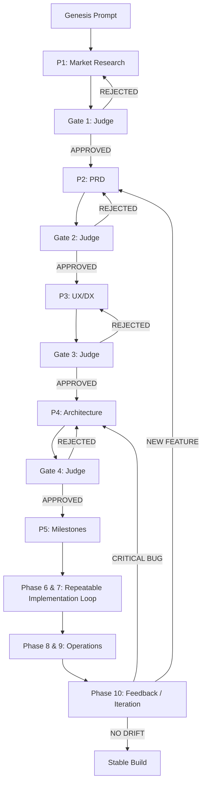

# Limesoda Architecture: The SDLC Graph

You are right—Limesoda is **not** a linear pipeline; it is a **Directed Cyclic Graph (DCG)** orchestrated by the Engineering Manager (EM) Agent.

## The Logical Topology

### Key Graph Transitions:
1. **Remediation Cycles:** When a Judge fails an artifact, the edge loops backward to the local Generator for a maximum of 3 retries.
2. **Escalation Edges:** If the 3-retry limit is triggered, the node breaks the graph and creates a **Human Interruption** event.
3. **Cross-Phase Rollbacks:** If Phase 7 (Code) fails repeated tests, the EM can route the edge all the way back to Phase 4 (Architecture) to force a structural redesign.
