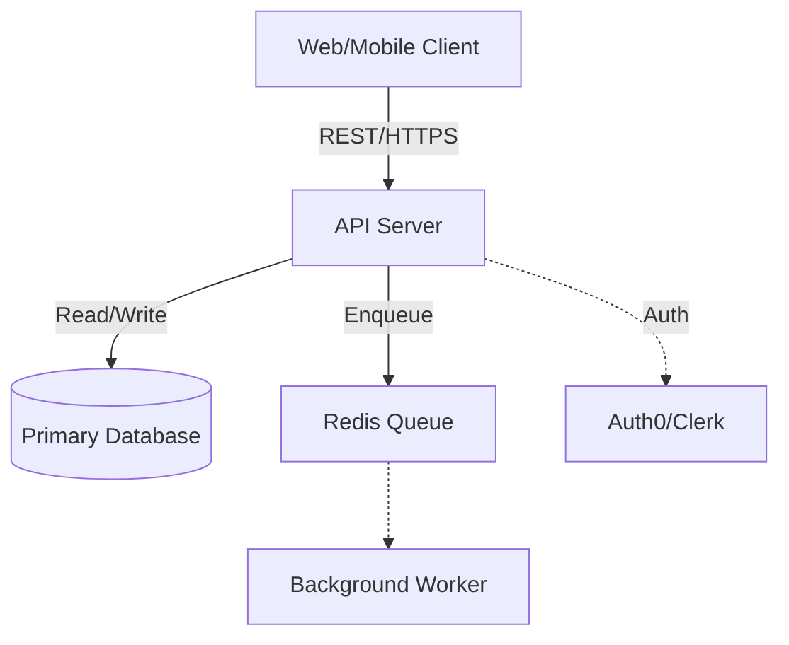

# Architecture Technical Design Document (RFC) Template

> **Instructions for Architect Agent:** This document is the ultimate source of truth for the Developer Agents. You must provide concrete code blocks (Prisma, SQL, OpenAPI, Terraform descriptors). Do not use vague language. If a database property is missing here, the Developer Agent will not build it.

---

## 1. System Context & Tech Stack Selection
* **Summary:** What is the technical objective of this system?
* **Core Tech Stack:**
    * **Frontend:** [e.g., Next.js (App Router), TailwindCSS]
    * **Backend:** [e.g., Node.js with Express, or Python/FastAPI]
    * **Runtime Environment:** [e.g., Node.js 20 LTS, Python 3.11, Dockerized Alpine Linux]
    * **Database:** [e.g., PostgreSQL natively or via Prisma ORM]
    * **Infrastructure:** [e.g., AWS ECS, Vercel, Supabase]
    * **Offline / Batch Pipelines:** [e.g., Apache Airflow, AWS Step Functions, Celery/Redis background workers]
    * **CI/CD Pipelines:** [e.g., GitHub Actions running `npm test` -> Terraform apply]
* **NFR Justification:** Briefly explain why this stack was chosen based on the Non-Functional Requirements (latency, scaling constraints) from the PRD.

---

### 1.2 Design Critique & Alternative Analysis (Anti-Patterns)
**Instructions for Architect Agent:** This section is mandatory. You must explicitly critique your own design above. Look for:
1. **Distributed Consistency (Dual-Write)**: Are you updating two systems (e.g., SQL + Temporal) in the same transaction? If so, what happens if one fails?
2. **Persistence Anti-Patterns**: Are you using a relational DB for high-volume logs or time-series data?
3. **Maintenance Overhead**: Can the "Community" and "Cloud" tiers be unified while still allowing for cloud-native optimizations (e.g., Log Sinks vs. SQL Audit)?

---

## 2. High-Level Architecture Diagram
Provide a Mermaid.js diagram illustrating the high-level flow of the system, including the client application, API layers, database, background workers, and any crucial external third-party services (e.g., Stripe, AWS S3).



---

## 3. Core Data Models / Database Schema
Provide the exact technical specifications required to store and protect application data. **Must include an ERD (Entity Relationship Diagram) or database chart illustrating the primary tables and their relations.**

### 3.1 Security & Data Privacy Constraints
* **PII Handling:** Which columns contain Personally Identifiable Information? Are they encrypted at rest?
* **Row-Level Security / DB Auth:** How enforces the RBAC matrix defined in the PRD at the database level?

---

## 4. API Contracts (OpenAPI / GraphQL)
**How this differs from the Phase 3 DX Prototype:** The Phase 3 DX Prototype defined the "ideal" ergonomic flow for humans. This section translates that ideal prototype into a rigid, technically feasible contract by strictly typing the data (e.g., UUIDs vs Strings), adding necessary pagination, and ensuring it mathematically aligns with the Database Schema defined in Section 3—all without sacrificing the intended developer experience.

### 4.1 Endpoint Specifications
*(List the physical endpoints with exact typing, required DB bindings, expected headers, and strictly typed JSON structure.)*

* **Path:** `POST /api/users`
* **Auth Required:** `Bearer Token (Admin Only)`
* **Request Body Schema:**
```json
{
  "email": "string, required",
  "name": "string, optional"
}
```
* **Response Headers / Codes:** `201 Created`, `403 Forbidden`, `400 Bad Request`

*(Repeat 4.1 for all required routes)*

---

## 5. Infrastructure & Deployment Topology
Instruct the DevOps/Infra Agent on how to scaffold the cloud environment.
* **Hosting Strategy:** Serverless vs. Containers vs. EC2.
* **CI/CD Pipeline Steps:** What scripts must run (e.g., `npm run lint`, `npm run test`, `docker build`).
* **Environment Variables Required:** (List the secret keys that need to be injected into the CI pipeline, e.g., `DATABASE_URL`, `STRIPE_SECRET_KEY`).

---

## 6. Internal Module Interfaces & Event Flow
If the system is complex (Microservices or Modular Monolith), how do the internal components communicate?
* **Synchronous vs Asynchronous:** Does the `OrderService` call the `InventoryService` directly via REST/gRPC, or does it publish an event to an Event Bus (e.g., Redis PubSub, RabbitMQ)?
* **Sequence Diagram:** Use a Mermaid sequence diagram (`sequenceDiagram`) to map out complex multi-step flows (e.g., Checkout -> Payment SDK -> Webhook -> DB).

---

## 7. Third-Party Integrations & Webhooks
Define exactly how the system interacts with external vendors to prevent the Implementer Agent from guessing SDK usage.
* **Vendor Name:** [e.g., Stripe, OpenAI, Twilio]
* **Integration Method:** [e.g., `stripe-node` SDK vs raw HTTP REST]
* **Expected Webhooks:** What events is the vendor sending back to us, and which internal API endpoint handles them?

---

## 8. Error Handling & Standard Responses
Define the standardized fallback conventions. If the Developer Agent doesn't have this, it will throw completely random error payloads.
---

## 9. Component Sub-Design Checklist (LLD Handoff)
Provide a prioritized checklist of the individual Low-Level Designs (LLDs) that must be drafted in Phase 5 before actual Implementation (Phase 6) begins. 

*Break the architecture down into logical components (e.g., "Authentication Module", "Payment Processing Cron Job", "Dashboard UI Context").*

### Checklist
- [ ] **[Component 1 Name]**: Description of what this component is and why it needs its own specific Low-Level Design doc.
- [ ] **Database Chart & Migration Plan**: Comprehensive ERD (Entity Relationship Diagram), indexing strategy for high-density lookups, and initial SQL DDL scripts.
- [ ] **[Component 2 Name]**: Description...
- [ ] **[Component 3 Name]**: Description...
